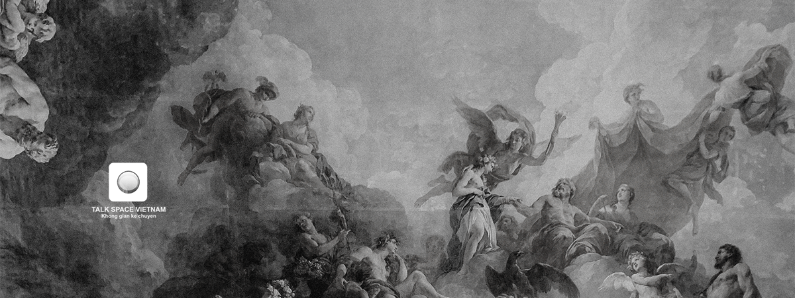

# About YourSpace

10,000 unique collectible characters with proof of ownership stored on the Ethereum blockchain. The project that inspired the modern CryptoArt movement. Selected press and appearances include [Mashable](https://mashable.com/2017/06/16/cryptopunks-ethereum-art-collectibles/), [CNBC](https://www.cnbc.com/2021/02/25/nfts-why-digital-art-and-sports-collectibles-are-suddenly-so-popular.html), [The Financial Times](https://www.ft.com/content/f9c1422a-47c9-11e8-8c77-ff51caedcde6), [Bloomberg](https://www.bloomberg.com/news/articles/2021-03-08/bitcoin-btc-mania-boosts-crypto-art-such-as-a-lebron-video-are-nfts-worth-it), [MarketWatch](https://www.marketwatch.com/story/obviously-we-had-no-idea-it-was-going-to-get-here-say-the-guys-who-made-the-first-nft-11615324003), [The Paris Review](https://www.theparisreview.org/blog/2018/01/23/much-pepe-scenes-first-rare-digital-art-auction/), [Salon](https://www.salon.com/2018/01/07/the-world-of-cryptocollectibles-like-cryptokitties-looks-like-the-internets-early-days/), [The Outline](https://theoutline.com/post/5055/puttin-art-on-the-dang-blockchain), [BreakerMag](https://breakermag.com/how-cryptopunks-creators-charmed-the-art-world-and-paved-the-way-for-blockchain-art/), [Christie's of London](https://christies.com/exhibitions/2018/art-and-tech-summit-exploring-blockchain), [Art|Basel](https://www.artbasel.com/events/detail/7953/Conversations-Art-Market-Talk-Which-Art-Problems-can-Blockchain-Solve), [The PBS NewsHour](https://www.pbs.org/newshour/show/how-blockchain-technology-could-revolutionize-the-art-market), [The New York Times in 2018](https://www.nytimes.com/2018/01/13/arts/cryptocurrency-art-market.html) and [again in 2021](https://www.nytimes.com/2021/03/11/arts/design/nft-auction-christies-beeple.html). The Cryptopunks are one of the earliest examples of a "Non-Fungible Token" on Ethereum, and were inspiration for the [ERC-721 standard](https://eips.ethereum.org/EIPS/eip-721) that powers most digital art and collectibles.

The CryptoPunks are 10,000 uniquely generated characters. No two are exactly alike, and each one of them can be officially owned by a single person on the [Ethereum](https://en.wikipedia.org/wiki/Ethereum) blockchain. Originally, they could be claimed for free by anybody with an Ethereum wallet, but all 10,000 were quickly claimed. Now they must be purchased from someone via the marketplace that's also embedded in the blockchain. Via this market you can buy, bid on, and offer punks for sale. Below, you'll find information about the status of each Punk in the market. Punks with a blue background are not for sale and have no current bids. Punks with a red background are available for sale by their owner. Finally, punks with a purple background have an active bid on them.

See the [marketplace instructions](https://cryptopunks.app/#getapunk) below to acquire your very own punk. You should also join the [Discord Chat](https://discord.gg/tQp4pSE), which includes a bot that announces all bids, offers and sales in realtime.

